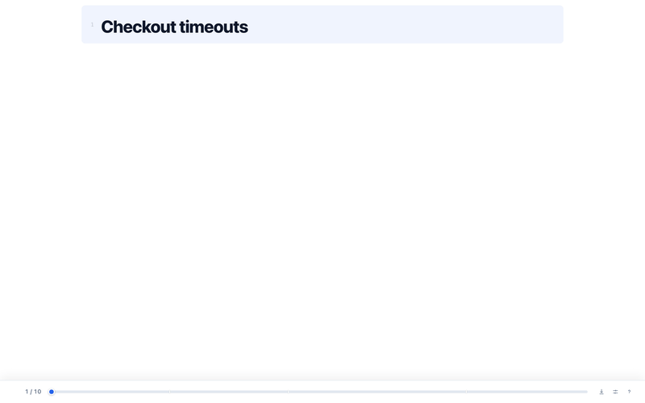
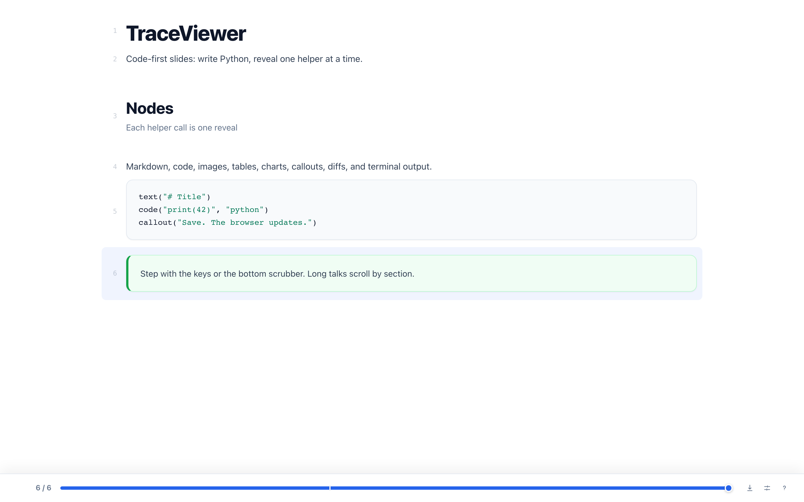
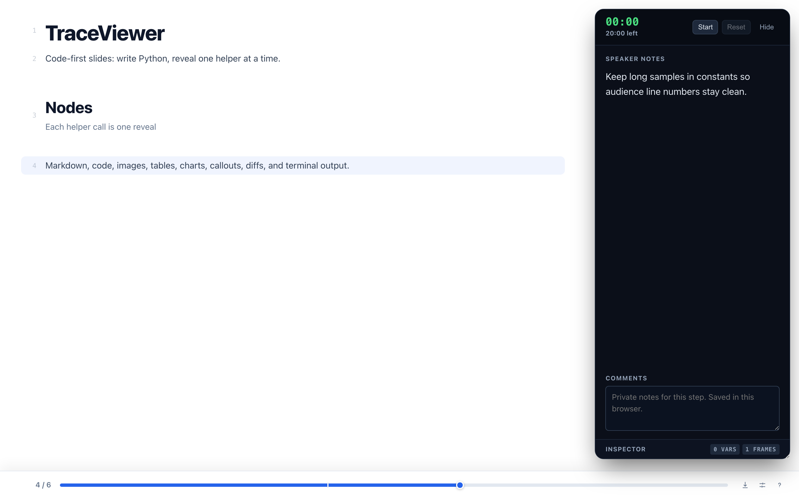
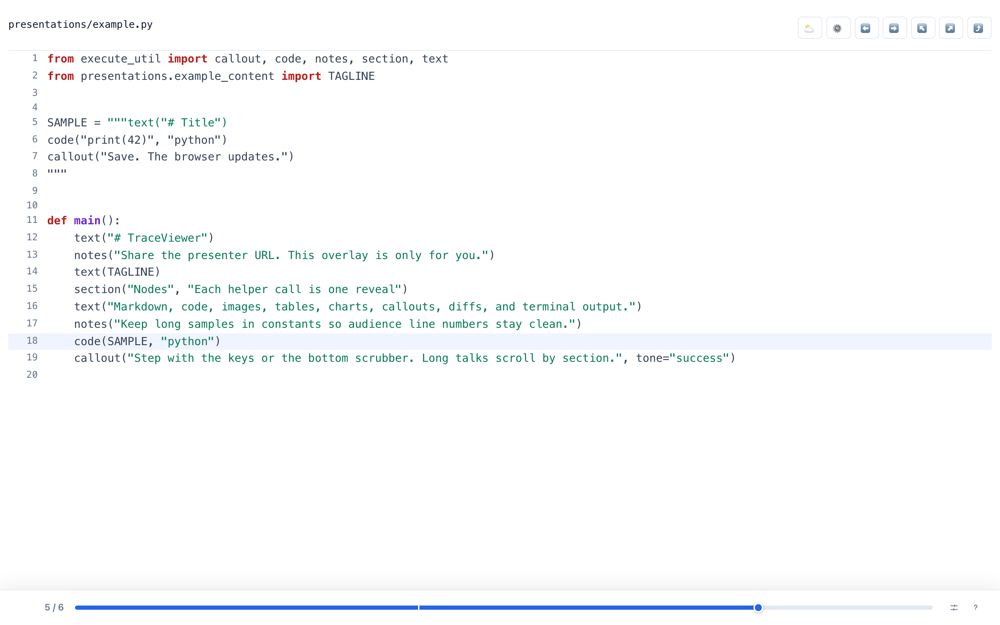
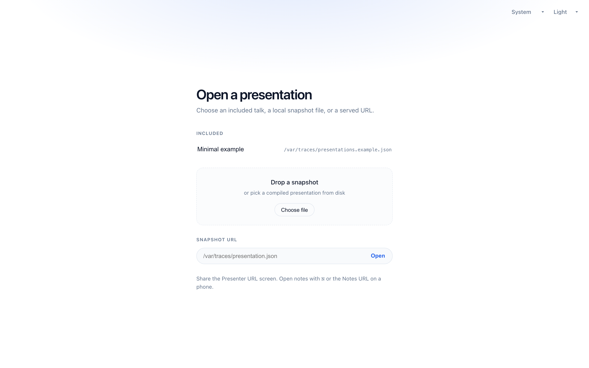

# TraceViewer

Code-first slides for technical talks. Write a small Python program, save it,
and reveal the talk one step at a time in a browser. No separate slide deck.



<p align="center">
  
</p>

<table>
  <tr>
    <td align="center">
      <br>
      <sub>Presenter overlay with notes and inspector</sub>
    </td>
    <td align="center">
      <br>
      <sub>Source view of the same step</sub>
    </td>
  </tr>
</table>

<p align="center">
  <br>
  <sub>Landing page: open the bundled example, a local file, or a snapshot URL</sub>
</p>

```bash
./scripts/bootstrap.sh
traceviewer dev presentations.example
```

## Features

- Author in Python with live reload
- Presenter, notes, and audience URLs with separate tokens
- Static JSON snapshots you can host on any web server
- Markdown, code, images, tables, charts, callouts, diffs, and terminal output
- Keyboard navigation; the current step lives in the URL
- Offline TeX through a compact bundled MathJax profile

## Requirements

- Node.js 18 or newer and npm
- Python 3.11 or newer

Windows: `scripts\bootstrap.cmd`. Or install by hand:

```bash
npm ci
python -m pip install -e 'producer[live]'
```

## Quick start

`traceviewer dev` serves the viewer, starts live reload, and opens the
presenter URL. Use `--no-open` to print URLs only.

The bundled example also opens as a static snapshot:

```text
http://localhost:5173/?trace=/var/traces/presentations.example.json&animate=1
```

Viewer contributors can run `npm run dev` and `traceviewer live` separately.
If setup fails, run `traceviewer doctor`.

## Write a presentation

```bash
traceviewer new hello
traceviewer dev presentations.hello
```

```python
from execute_util import callout, code, notes, section, text

SAMPLE = """def main():
    print("Hello")
"""


def main():
    text("# My first presentation")
    notes("Introduce the problem this talk will solve.")
    text("Each helper call becomes a playback step.")
    section("Code", "Show only what supports the story")
    code(SAMPLE, "python")
    callout("Save the file to update the live presentation.", tone="success")
```

Keep long samples in constants above `main()`. Only helper calls inside the
flow become audience rows.

New modules under `presentations/` stay local and are gitignored, except the
bundled [example](presentations/example.py). Rebuild that snapshot with
`traceviewer build presentations.example --include-notes`.

The helper reference is in
[the authoring API](skills/traceviewer-authoring/references/authoring-api.md).
The full workflow is in [Authoring presentations](docs/AUTHORING.md).

Never commit or share a live session token.

## Present

Live mode prints three URLs:

| URL | Role |
| --- | --- |
| Presenter | Shared deck and control. Share this screen. |
| Notes | Optional phone or second window. Same control, speaker notes. |
| Audience | Follow-only. No notes, no control. |

`P` toggles an on-slide notes overlay. `N` opens the notes window. Changing
`role=audience` to `role=presenter` in the URL does not grant access.

| Key | Action |
| --- | --- |
| `→` `L` | Next step |
| `←` `H` | Previous step |
| `J` / `Shift`+`→` | Step over forward |
| `K` / `Shift`+`←` | Step over backward |
| `U` | Step out |
| `A` | Progressive reveal |
| `R` | Audience / source view |
| `P` | Presenter overlay |
| `N` | Notes window |
| `G` | Open another snapshot |
| `S` | Settings |
| `?` | Shortcuts |

## Share a static deck

```bash
traceviewer build presentations.hello
traceviewer pack presentations.hello --output dist/hello-presentation
traceviewer serve --dist-path dist/hello-presentation
```

`build` writes `public/var/traces/presentations.hello.json`. `pack` copies the
viewer, that snapshot, and its local images. To host the whole app, run
`npm run build` and serve `dist/`.

Rebuild and install on another machine with
[Building on another host](docs/BUILD.md).

## Documentation

See [docs/README.md](docs/README.md) for the full index.

- [Authoring presentations](docs/AUTHORING.md)
- [Building on another host](docs/BUILD.md)
- [Authoring API](skills/traceviewer-authoring/references/authoring-api.md)
- [Trace format](docs/TRACE_FORMAT.md)
- [Live protocol](docs/LIVE_PROTOCOL.md)

## License

MIT. Copyright (c) 2026 [MANA-Y](LICENSE).
